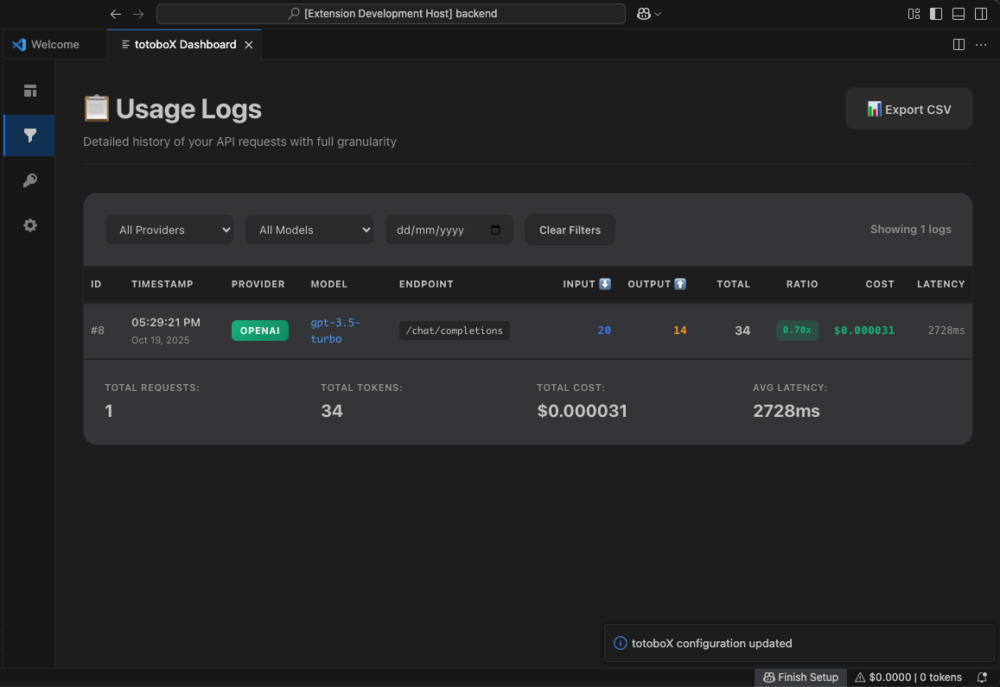

# 🎯 totoboX - AI API Cost Tracker

> Real-time cost tracking and analytics for OpenAI, Anthropic, and other AI APIs directly in VS Code

[](https://marketplace.visualstudio.com/)
[](https://opensource.org/licenses/MIT)

Track every AI API call, monitor token usage, and analyze costs in real-time without changing a single line of your code.

---

## ✨ Features

### 📊 **Real-Time Dashboard**
- **6 Stat Cards**: Today's cost, input/output tokens, total tokens, API calls, active keys
- **4 Interactive Charts**: Input tokens, output tokens, API call frequency, cost distribution
- **Smart Time Windows**: Auto-adjusts from hourly (1H) to monthly (30D) based on usage volume
- **Live Updates**: Automatic refresh with configurable intervals

### 📋 **Detailed Activity Logs**
- **10+ Data Points**: ID, timestamp, provider, model, endpoint, input/output tokens, ratio, cost, latency
- **Advanced Filters**: Filter by provider, model, or date range
- **Efficiency Metrics**: Color-coded ratio indicators for optimization insights
- **CSV Export**: Export full logs for analysis in Excel/Google Sheets

### 🔐 **Secure Proxy System**
- **Zero Code Changes**: Replace your API key with a trackable proxy key
- **Multi-Provider Support**: OpenAI, Anthropic, Gemini, Meta Llama, Perplexity
- **Encrypted Storage**: AES-256 encryption for all API keys
- **Multiple Keys**: Manage and switch between multiple API keys

### 🎨 **Beautiful UI**
- Modern gradient designs with smooth animations
- Dark/Light mode compatible with VS Code themes
- Responsive layout for all screen sizes
- Professional charts with custom canvas rendering

---

## 📸 Screenshots

### Dashboard Overview

*Real-time cost tracking with 6 stat cards and 4 interactive charts*

### Activity Logs

*Detailed logs with 10+ data points and advanced filtering*

### Time Window Selection

*Smart time windows auto-adjust from hourly to monthly views*

### Proxy Key Generation

*One-click proxy key generation with usage examples*

---

## 🚀 Quick Start

### Installation

1. **Install from VS Code Marketplace**
```
   Search "totoboX" in VS Code Extensions (Cmd+Shift+X)
```

2. **Open totoboX Dashboard**
```
   Cmd+Shift+P → "totoboX: Show Dashboard"
```

### Setup

1. **Generate Your Proxy Key**
   - Enter your OpenAI/Anthropic API key
   - Select provider and model
   - Click "Generate Proxy Key"
   - Copy the generated `totobox_xxxxx` key

2. **Replace Your API Key**

   **Python:**
```python
   from openai import OpenAI
   
   client = OpenAI(
       api_key="totobox_xxxxx",  # Your proxy key
       base_url="https://totobox.vercel.app/api/proxy"
   )
```

   **JavaScript:**
```javascript
   import OpenAI from 'openai';
   
   const client = new OpenAI({
       apiKey: 'totobox_xxxxx',
       baseURL: 'https://totobox.vercel.app/api/proxy'
   });
```

   **cURL:**
```bash
   curl https://totobox.vercel.app/api/proxy \
     -H "Authorization: Bearer totobox_xxxxx" \
     -H "Content-Type: application/json" \
     -d '{"model": "gpt-3.5-turbo", "messages": [...]}'
```

3. **Watch Your Costs**
   - Dashboard updates automatically
   - View detailed logs in Logs tab
   - Export CSV for deeper analysis

---

## 🛠️ Tech Stack

**Frontend:**
- VS Code Extension API
- TypeScript
- Custom canvas chart rendering
- Encrypted local storage

**Backend:**
- Vercel (Serverless Functions)
- Supabase (PostgreSQL)
- Node.js

**Features:**
- Real-time analytics with 10-second caching
- AES-256 encryption for API keys
- Multi-provider proxy routing
- Automatic token accounting

---

## 📊 Use Cases

### **Individual Developers**
- Track personal AI API costs
- Optimize prompt efficiency with ratio metrics
- Debug slow API calls with latency tracking
- Export data for expense reporting

### **Teams & Companies**
- Monitor team API usage across projects
- Identify cost-heavy operations
- Track usage by different models/providers
- Analyze patterns over time

### **AI App Developers**
- Test different models and compare costs
- Optimize token usage with input/output analytics
- Monitor production API performance
- Debug API issues with detailed logs

---

## ⚙️ Configuration

Access settings via the Settings tab in the dashboard:

- **Backend URL**: Custom backend endpoint (default: totobox.vercel.app)
- **Refresh Interval**: Auto-refresh frequency (10-300 seconds)
- **Environment**: Development/Staging/Production
- **Notifications**: Toggle success/error notifications

---

## 🔒 Security & Privacy

- **Your API keys never leave your machine unencrypted**
- AES-256 encryption with unique master key per installation
- Proxy keys are one-way: can't be reverse-engineered to original key
- All data stored in your private Supabase instance
- Open source - audit the code yourself

---

## 📈 Roadmap

- [ ] Support for more AI providers (Cohere, AI21, etc.)
- [ ] Team collaboration features
- [ ] Budget alerts and spending limits
- [ ] Advanced analytics (predictions, trends)
- [ ] Export to other formats (JSON, Excel)
- [ ] API key rotation
- [ ] Webhook integration

---

## 🤝 Contributing

Contributions are welcome! Please feel free to submit a Pull Request.

1. Fork the repository
2. Create your feature branch (`git checkout -b feature/AmazingFeature`)
3. Commit your changes (`git commit -m 'Add some AmazingFeature'`)
4. Push to the branch (`git push origin feature/AmazingFeature`)
5. Open a Pull Request

---

## 📝 License

This project is licensed under the MIT License - see the [LICENSE](LICENSE) file for details.

---

## 🐛 Known Issues

- Charts require multiple API calls to show visible data (use longer prompts for testing)
- Some canvas elements may not render on first load (click Refresh)

---

## 💬 Support

- **Issues**: [GitHub Issues](https://github.com/[YOUR_USERNAME]/totobox/issues)
- **Email**: [YOUR_EMAIL]
- **Twitter**: [@YOUR_HANDLE]

---

## 🙏 Acknowledgments

Built with:
- [Supabase](https://supabase.com) - Backend infrastructure
- [Vercel](https://vercel.com) - Serverless deployment
- [VS Code Extension API](https://code.visualstudio.com/api) - Extension framework

---

**Made with ❤️ by [YOUR NAME]**

*Track smarter. Build better. Ship faster.*